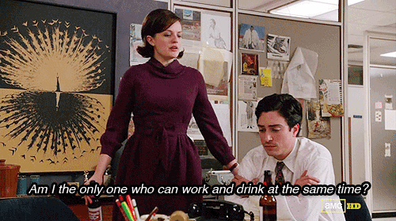
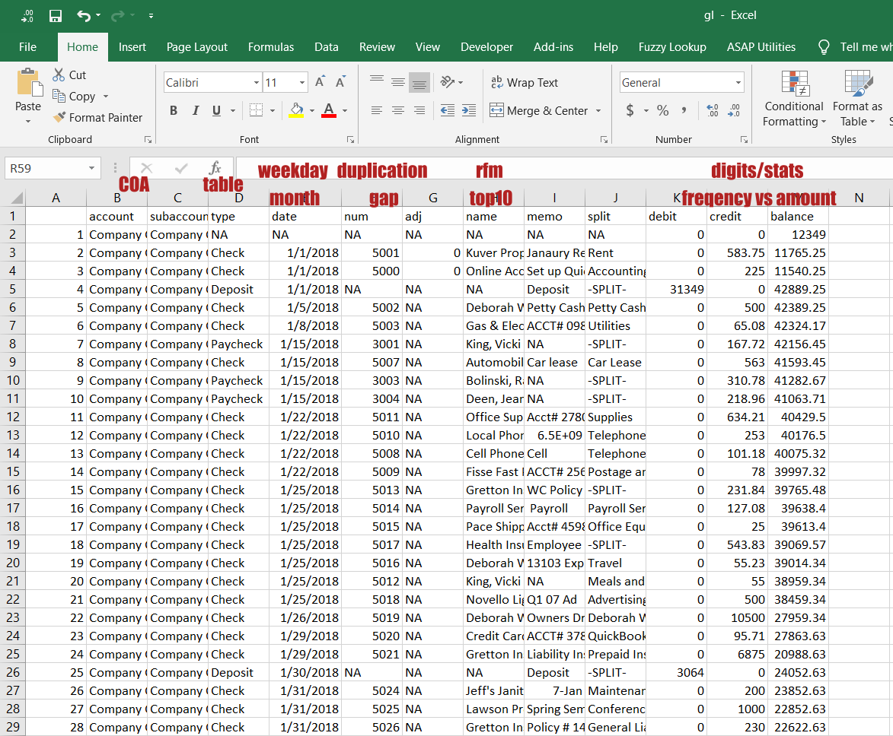

# Audit Working Papers

## Introduction

Accounting professionals tend to work under pressure so that they can cover as much ground as possible. However, tools at their disposal often have very limited power and are unable to optimistically fit their workflow. Furthermore, their work is prone to errors due to too many copy+paste and unreproduciblity.

In my view, **R** is a perfect tool to increases their productivity and conform to their workflow. Watch [Hadley Wickham on Data Science Challenges](https://www.youtube.com/watch?v=bWM1BszF-Mo&t=1543s) and [Data visualization and data science, Hadley Wickham](https://www.youtube.com/watch?v=9YTNYT1maa4) to learn more about it.

Data analytics lifecycle described by [R4DS](https://r4ds.had.co.nz/) sensibly matchs audit routines. This document is meant to demonstrate the usefulness of R in the field of audit via a specific use case. 

## Case study

To read this case study, you should have a basic knowledge of:    

* IFRS and audit techniques;    
* accounting ERP systems (Oracle or SAP);    
* Data analytics;    

The case study assumes that auditors are at the stage of audit planning and will use R to perform audit procedures. The data can be downloaded from ["Data mining your general ledger with Excel"](https://www.journalofaccountancy.com/issues/2017/jan/general-ledger-data-mining.html). 

Unless there are unknown bank accounts, all company transactions will be recorded in G/L. G/L contains valuable information for auditors to perform risk assessment and preliminary analytical procedures efficiently and effectively. Unfortunately, auditors often have difficulties in cleaning and extracting information in G/L. This is particularly true in the case of JV memo or description. Using R to solve those issues would be like a breeze. 

{width=80% height=20%}

